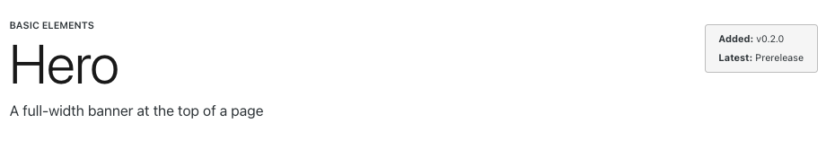

# Reservoir Design System


[](https://badge.fury.io/js/%40nypl%2Fdesign-system-react-components)

The Reservoir Design System (DS) is an open-source, extensible React library for NYPL products and experiences with accessibility at its core. It ships functional components with consistent NYPL styling.

Storybook documentation:

- [v4 docs (current)](https://nypl.github.io/nypl-design-system/reservoir/v4/?path=/docs/welcome--docs)
- [v3 docs](https://nypl.github.io/nypl-design-system/reservoir/v3/?path=/docs/welcome--docs)
- [Development/QA branch docs](https://nypl-design-system.vercel.app/?path=/docs/welcome--docs)

| Table of Contents |                                                                                                 |
| ----------------- | ----------------------------------------------------------------------------------------------- |
| 1.                | [Get started using the Reservoir Design System](#get-started-using-the-reservoir-design-system) |
| 2.                | [Using Chakra UI components](#using-chakra-ui-components)                                       |
| 3.                | [Accessibility](#accessibility)                                                                 |
| 4.                | [Contributing](#contributing)                                                                   |
| 5.                | [Git workflow and releases](#git-workflow-and-releases)                                         |
| 6.                | [CDN](#cdn)                                                                                     |

## Get started using the Reservoir Design System

1. Install the npm package in your app's directory.

```sh
$ npm install @nypl/design-system-react-components
```

2. Add the `DSProvider`.

In order to properly render styles, you must wrap all Reservoir components with a `DSProvider` component.

```jsx
// your main application file
import { DSProvider } from "@nypl/design-system-react-components";
// ...
const ApplicationContainer = (props) => {
  // ...
  return (
    <header>...</header>
      <DSProvider>
        <div className="my-app">
          // ...
          {children}
        </div>
      </DSProvider>
    <footer>...</footer>
  );
};
```

3. Import the `@nypl/design-system-react-components/dist/styles.css` file.

This file contains additional, minified styles – normalized reset CSS rules, system fonts, the `react-datepicker`'s styles, breakpoint CSS variables, and overriding styles for a few components.

Where you import this file varies on the stack of the application.

For Next apps, the file can be imported in the `_app.tsx` file:

```tsx
// _app.tsx
@import "@nypl/design-system-react-components/dist/styles.css";

import {
  DSProvider
} from "@nypl/design-system-react-components";
```

Otherwise, it can be imported in the app's main SCSS file:

```scss
// main.scss (for example)
@import "@nypl/design-system-react-components/dist/styles.css";

body {
  // ...
}
```

For apps using parcel, prepend the string import with `npm:`.

```scss
@import "npm:@nypl/design-system-react-components/dist/styles.css";
```

4. Use DS components!

Consult [Storybook](https://nypl.github.io/nypl-design-system/reservoir/v4/?path=/docs/welcome--docs) for the list of available components and how to use them.

## Using Chakra UI components

The Reservoir Design System is generally built _on top of_ [Chakra v2](https://v2.chakra-ui.com/), but the following Chakra components are exported _directly_ for your use: `Box`, `Center`, `Circle`, `Grid`, `GridItem`, `HStack`, `Square`, `Stack`, `VStack`.

## Accessibility

Accessibility is a main priority of the Reservoir Design System.

On top of built-in accessibility from Chakra, DS components link labels with input elements, add correct `aria-*` attributes, visually hide important text for screenreader users, and much more.

Reservoir makes use of:

- `eslint-plugin-jsx-a11y` for finding accessibility errors through linting and through IDE environments.
- `jest-axe` for running [`axe-core`](https://github.com/dequelabs/axe-core) on _every_ component's unit test file. This is part of the automated tests that run in Github Actions through the `npm test` command.
- `@storybook/addon-a11y` for real-time accessibility testing in the browser through Storybook. _Every_ component has a tab that displays violations, passes, and incomplete checks performed by `axe-core`.

Additionally, DS components include detailed accessibility information in their Storybook documentation.

## Contributing

Follow these steps to setup a local installation of the project:

1. Clone the repo

```sh
$ git clone https://github.com/NYPL/nypl-design-system.git
```

2. Install dependencies

```sh
$ npm install
```

3. Run the Storybook instance and view it at `http://localhost:6006`

```sh
$ npm run storybook
```

Information about active maintainers, how we run reviews, and more can be found in our wiki page for [Contributing to the Design System](https://github.com/NYPL/nypl-design-system/wiki/Contributing-to-the-React-Library).

Follow the [contribution document](/.github/CONTRIBUTING.md) to follow git branching conventions, component creation and update guidelines, testing methodology, and documentation guidelines.

### Typescript usage

The Reservoir Design System is built with Typescript. Check out the Design System's [Typescript documentation](/TYPESCRIPT.md) for more information on why we chose to build React components in Typescript and the benefits and gotchas we encountered.

### Node version

The DS uses Node version 20.x and we do not support any Node versions below 20.x. The Github Actions for linting, automated testing, deploying to Github Pages, and releasing to npm are all running on Node 20.x.

If you are using `nvm`, the local `.nvmrc` file (using `20.x`) can be used to set your local Node version with the `nvm use` command. Make sure your machine has Node version 20.x installed through `nvm` already.

### Component documentation

When developing components or fixing bugs, make sure to update or create the related Storybook doc(s).

To create a story:

1. Add a `[component-name].mdx` file in the `src/components/[component-name]/` directory.
2. Make sure the file is referenced in the `stories` array of `.storybook/main.ts`

For information on how to write stories, check out the [Anatomy of a Story](https://github.com/NYPL/nypl-design-system/wiki/Anatomy-of-a-Story) wiki page.

### Component header

Each story page starts with a component header. It includes the component category, name, summary, and versioning information.

**Example component docs header**

<ComponentDocsHeader
  category="Basic Elements"
  componentName="Hero"
  summary="A full-width banner at the top of a page"
  versionAdded="0.2.0"
  versionLatest="Prerelease"
/>



### Unit testing

The Reservoir Design System runs unit tests with Jest and React Testing Library.

To run all tests once:

```sh
$ npm test
```

If you're actively writing or updating tests, you can run the tests in watch mode. This will wait for any changes and run when a file is saved:

```sh
$ npm run test:watch
```

If you want to run tests on only one specific file, run:

```sh
$ npm test -- src/[path/to/file]
```

For example, to test the `Link` component, run:

```sh
$ npm test -- src/components/Link/Link.test.tsx
```

### Snapshot testing

If a component's DOM or SCSS styling was unintentionally updated, we can catch those bugs through snapshot testing. The NYPL DS implements snapshot testing with `react-test-renderer` and `jest`.

The `react-test-renderer` package, will create a directory and a file to hold `.snap` files after a unit test is created. Using the `Notification` component as an example, this is the basic layout for a snapshot test:

```tsx
import renderer from "react-test-renderer";

// ...

it("Renders the UI snapshot correctly", () => {
  const tree = renderer
    .create(
      <Notification
        id="notificationID"
        notificationHeading="Notification Heading"
        notificationContent={<>Notification content.</>}
      />
    )
    .toJSON();
  expect(tree).toMatchSnapshot();
});
```

If this is a new test and we run `npm test`, a [`/__snapshots__/Notification.test.tsx.snap`](/src/components/Notification/__snapshots__/Notification.test.tsx.snap) file is created. This holds the DOM structure as well as any inline CSS that was added.

```tsx
exports[`Notification Snapshot Renders the UI snapshot correctly 1`] = `
<aside
  className="notification notification--standard "
  id="notificationID"
>
  // Removed for brevity...
</aside>
`;
```

Now, if we unintentionally update the `Notification.tsx` component to render a `div` instead of an `aside` element, this test will fail.

If you want to update any existing snapshots, re-run the test script as:

```sh
$ npm test -- --updateSnapshot
```

Each snapshot file also includes a link to its [Jest Snapshot documentation](https://jestjs.io/docs/snapshot-testing) which is recommended to read!

### Storybook test addon

Through the [`@storybook/test`](https://www.npmjs.com/package/@storybook/test) plugin, we can see a component's suite of unit tests right Storybook. In the "Addons" panel, a "Test" tab will display all the tests for the current component and whether they pass or fail.

After writing new tests, run `npm run test:generate-output` to create a new JSON file that is used by Storybook. This JSON file contains all the test suites for all the components and Storybook picks this up and automatically combines a component with its relevant unit tests. Make sure to commit this file although new builds on Github Pages will recreate this file for the production Storybook instance.

### Static build

_Make sure not to commit the directory created from the following process_.

There should be no need to run the static Storybook instance while actively developing -- it's used exclusively for building out the `gh-pages` environment and deploying it to [Github Pages](https://nypl.github.io/nypl-design-system/reservoir/v4/?path=/docs/welcome--docs). In the event that you do want to run the static Storybook npm script, run:

```sh
$ npm run build-storybook:v4
```

You can then view `/reservoir/v4/index.html` in your browser. _Make sure not to commit this directory_.

## Git workflow and releases

There are currently three main branches for the DS:

- `development` is the main and default branch for the DS. All new feature and bug fix pull requests should be made against this branch.
- `release` is the production branch used to create Github releases, tags, and npm releases.
- `gh-pages` is the branch used to deploy the static Storybook instance to Github Pages, the DS' production Storybook instance.

When a new version of the DS is ready for release, the `development` branch is merged into the `release` branch through a pull request. Once merged, Github Actions will run to deploy the static Storybook as well as publish the new version to npm. Here is a [pull request](https://github.com/NYPL/nypl-design-system/pull/1532) that follows the convention outlined in [How to Run a Release](https://github.com/NYPL/nypl-design-system/wiki/How-to-Run-a-Release).

When working on a new feature or a bug fix:

1. Create a new branch off of `development` with the following naming convention: `[ticket-number]/your-feature-or-bug-name` (for example, `DSD-1234/add-more-animal-crossing-examples`).
2. Create a pull request that points to the `development` branch.
3. If your pull request is approved and _should_ be merged, a maintainer will add the "Ship It" Github label and you may merge it. Sometimes, features must wait; the "DO NOT MERGE" label will be added to these pull requests.

### Release candidates

For big feature updates, we'll often make a "release candidate" and test it in the [Turbine app](https://nypl-ds-test-app.vercel.app/) before the real release is made.

To create a release candidate:

1. Check out `development` or the feature branch containing your update
1. Update the `package.json` `version` to include the `-rc` suffix. For example, `1.5.0` becomes `1.5.0-rc`.
1. Delete the `package-lock.json` file and the `node_modules` directory.
1. Run `npm install` to install all the dependencies and create a new `package-lock.json` file with the updated version.
1. Run `npm publish` to publish the new release candidate version to npm. Make sure you have an npm account and have the correct permissions to publish to the `@nypl/design-system-react-components` package.

If a bug is found in testing:

1. Update or fix the bug in a new branch.
1. Once approved, merge the pull request into the feature or `development` branch.
1. Follow the same steps above to create a new release candidate version, but this time the `-rc` suffix should be incremented. For example, `1.5.0-rc` becomes `1.5.0-rc1`.
1. QA the new release candidate version in the Turbine test app.

If the release candidate version passed QA and is ready for production:

1. Celebrate.
1. Make sure all the new changes are merged into the `development` branch. Remove the `-rc` suffix from the version in the `package.json` file.
1. Delete the `package-lock.json` file and the `node_modules` directory.
1. Run `npm install` to install all the dependencies and create a new `package-lock.json` file with the updated version.
1. Push the changes to Github and create a new pull request from `development` that points to the `release` branch.
1. Once approved and merged, a Github Action will run that will automatically deploy the static Storybook to Github Pages and publish the new version to npm.

## CDN

You can also use the Design System styles in your project through the `unpkg` CDN, but note that this is not recommended for production use.

```html
<link
  href="https://unpkg.com/@nypl/design-system-react-components/dist/styles.css"
/>
<script src="https://unpkg.com/@nypl/design-system-react-components/dist/design-system-react-components.cjs" />
<script src="https://unpkg.com/@nypl/design-system-react-components/dist/design-system-react-components.js" />
```
